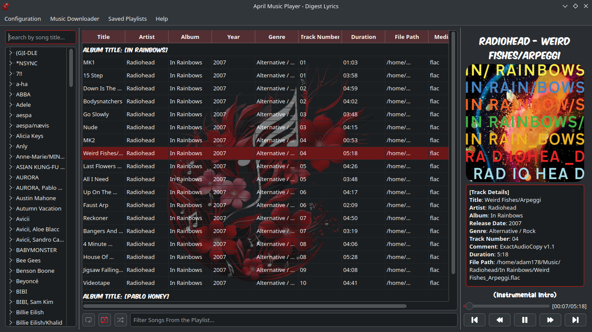
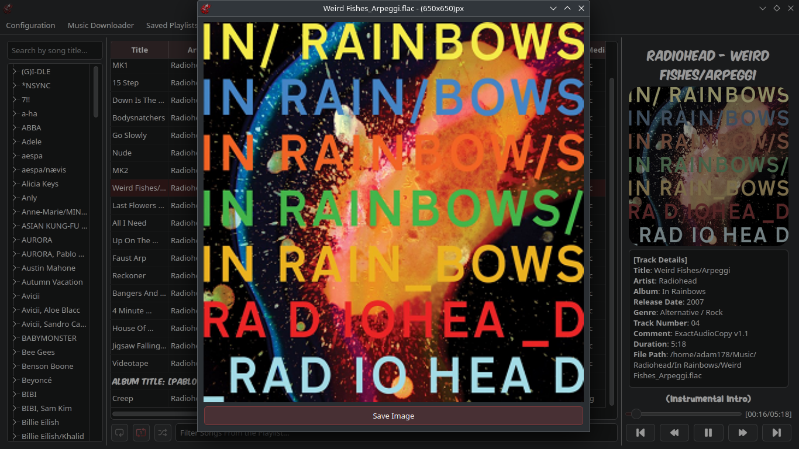
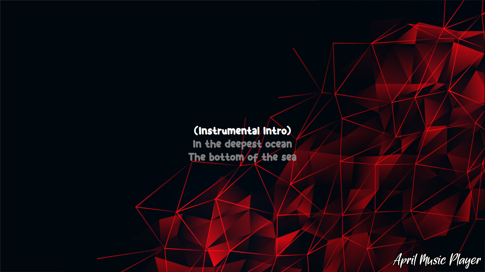
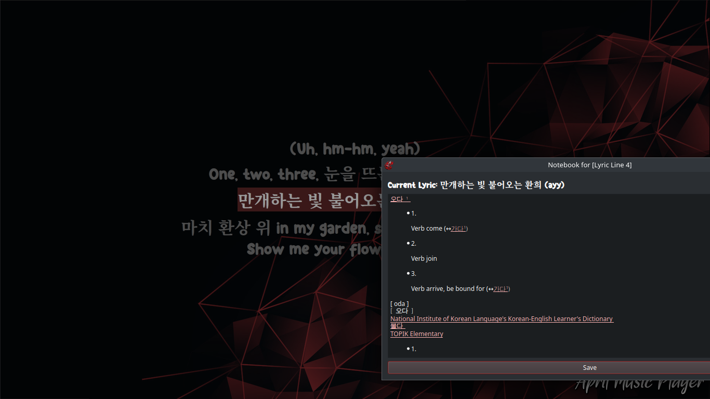
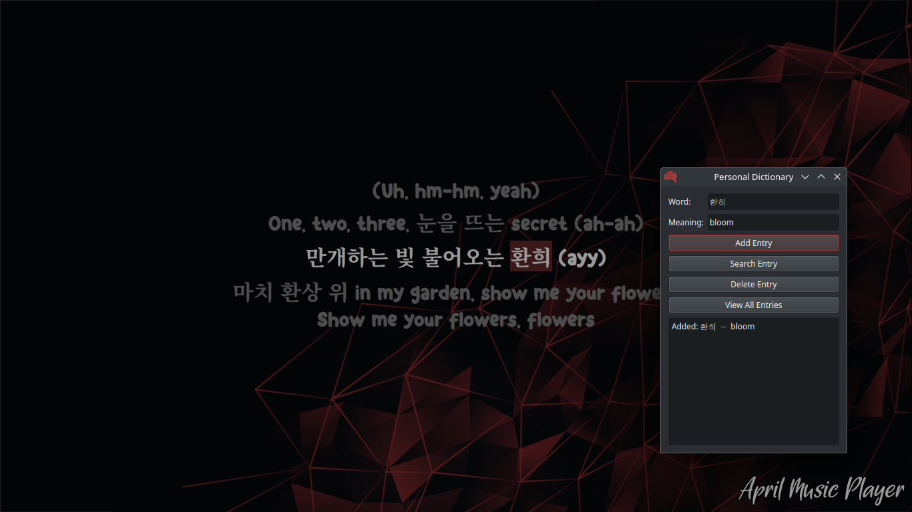
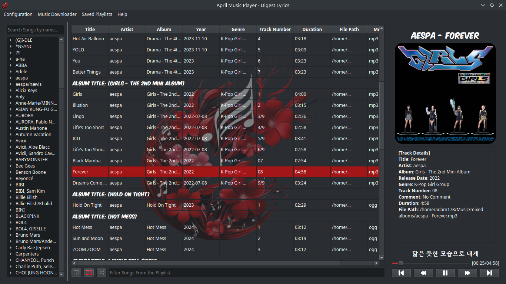
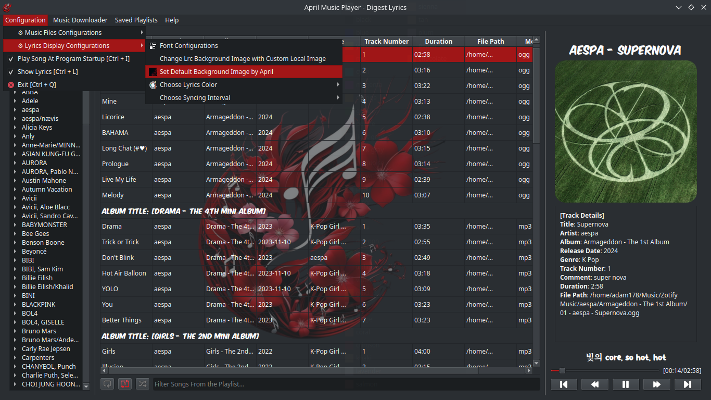
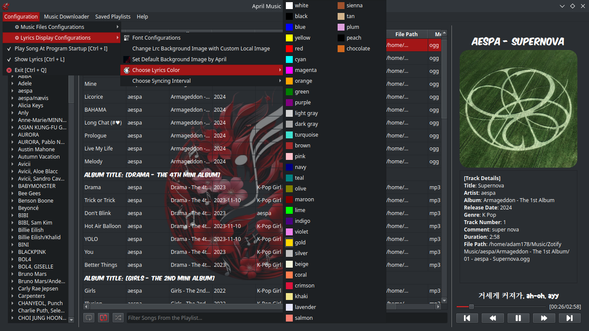
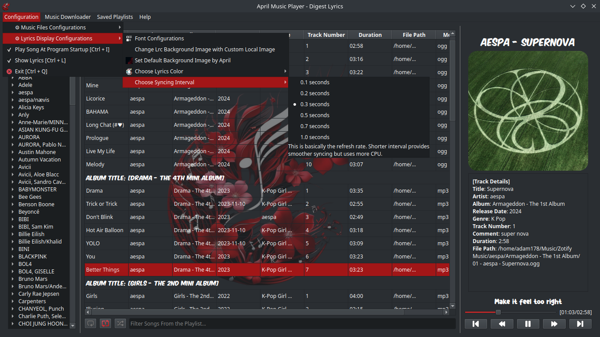
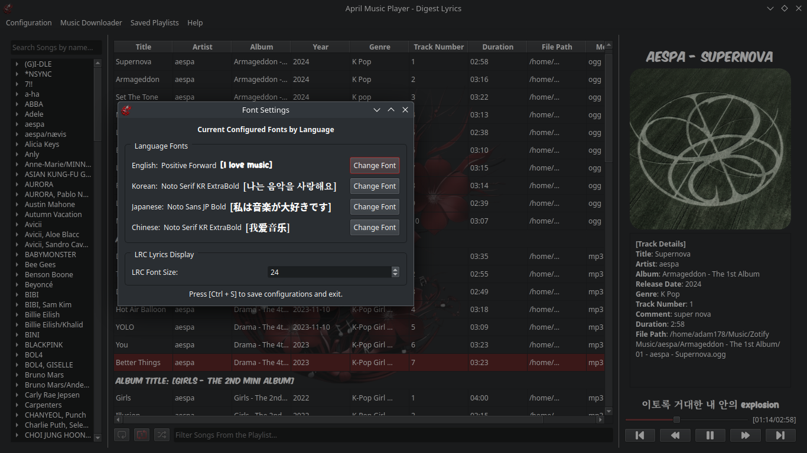

# April Music Player

April Music Player is a music player with lyric syncing and note-taking features, designed to help with lyric memorization. It's perfect for language learners who want to enjoy music while improving their language skills. The app offers a customizable lyrics display, note-taking features, and personal vocabulary collections to enhance the learning experience. **Presented to you by Aiden.**

### Screenshots
Here are some screenshots of April Music Player in action:

  
  
  
  
  
  
  
  
  
  

---

### Files preparation (music and lrc files)
Before using the player, you'll need to download your songs and lyrics in advance. I use Zotify to download songs from Spotify, and for LRC lyrics files, I recommend using LrcGet, Syrics on your laptop, or SongSync on Android. There are also various websites where you can download music with embedded metadata and lyrics.

- [Zotify](https://github.com/zotify-dev/zotify)
- [LrcGet](https://github.com/tranxuanthang/lrcget)
- [Syrics](https://github.com/akashrchandran/syrics)
- [SongSync](https://github.com/Lambada10/SongSync)
 
### Installation

- An installer for Windows is available in the releases section(outdated). However, since I don't use Windows, creating an installer can be tedious. So, I will only create an installer for major updates. I recommend running the program directly from the Python file for the best experience, as daily updates and bug fixes will be released frequently. [Download Windows Installer](https://github.com/amm926616/april-music-player-os/releases/download/windows-installers/april-open-source-v1.1-setup.exe)

- To run the project with Python, clone or download the repository:
    
    `git clone https://github.com/amm926616/april-music-player.git` or download the repo.

- Go inside the folder.
    
- (Optional) Create a virtual environment:

    `python -m venv .venv && source .venv/bin/activate`
    
- Install the required modules:

    `pip install -r requirements/requirements-windows.txt` for windows and `pip install -r requirements/requirements-linux.txt` for linux.
    
- Run the main script:
    
    `python main.py`

- Later, maybe you can create your own shortcut or script to automate the running process.     

## 🎹 **Keyboard Shortcuts**  

Master these shortcuts to navigate and control the app effortlessly:  

### 📝 **Getting Started**  
- Start by **double-clicking** on an item in the left layout's tree list:  
  - Double-click an **artist name** to load all songs by that artist into the playlist.  
  - Double-click an **album name** to load all songs from that album.  
  - Double-click a **single song** to add just that song to the playlist.  

### 🔗 **General**  
- **Left Arrow, Right Arrow**: Seek backward and forward.  
- **Spacebar**: Play/Pause the current song.  
- **Ctrl + R**: Play a random song from the playlist.  
- **Shift + Alt + R**: Restart the current playing song.  
- **Ctrl + Alt + R**: Update and reload the database.  
- **Ctrl + L**: Activate LRC (Lyrics) display, or double-click the progress bar.  
- **Ctrl + S**: Focus on the search bar. Inside the search bar, press **Enter** to play the matched song.  
- **Ctrl + Q**: Quit the program. The app continues running in the background even if you close the main window.  
- **Ctrl + I**: Enable/Disable lyrics syncing.  
- **Ctrl + G**: Highlight the row of the currently playing song in the playlist.  
- **Ctrl + P**: Stop the currently playing song.  
- **Ctrl + F**: Filter songs in the playlist or library.  
- **Ctrl + J**: Focus on the playlist layout.  
- **Ctrl + 1, 2, 3**: Activate playback modes:  
  - **1**: Loop the playlist.  
  - **2**: Repeat the current song.  
  - **3**: Shuffle the playlist.  
- **Del**: Remove a song from the playlist.  
- **Enter**: Play the selected song.  
- **F2**: Edit the selected song's metadata.  
- **Ctrl + C**: Copy the file path of the selected song.  
- **F10**: Enable/Disable full-screen mode.  
- **Esc**: Close most opened windows.  
- Double-click a tree list item to add it to the playlist.  
- Double-click a playlist item to play that song immediately.  

### 📜 **In LRC (Lyrics) View**  
- **F**: Toggle full-screen mode for the LRC view.  
- **D**: Jump to the start of the current lyric.  
- **Up Arrow, Down Arrow**: Navigate to the previous or next lyric line.  
- **E**: Open the Lyrics Notebook.  
- **Ctrl + D**: Open your personal dictionary.  

### 📔 **In Lyrics Notebook**  
- **Ctrl + S**: Save the text you’ve written.  
- **Esc**, **Ctrl + W**, **Alt + F4**: Exit the notebook without saving.  

### 📚 **Personal Dictionary**
- **Ctrl + D**: To open personal dictionary to collect vocabulary
- You can save the words you encounter on your own to the personal dictionary. 
- There are minimalistic buttons for the simple functions but I have power them with easy workflow without clicking one. 
- Pressing Enter in the word textbox activates searching words. 
- Pressing Enter in the meaning textbox activates saving new vocabulary. 

Also, try out my 'Personal Dictionary' stand along python application to collect vocabulary. It features a search system that shows words with similar syllables, mimicking how neurons connect in the brain. [personal-dictionary](https://github.com/amm926616/sqlite-personal-dictionary)

